<h2> Technoply Website </h2>
<h3 >A crypto marketplace website developed in Vanilla JavaScript. </h3>

<h4>Website Features</h4>

<ul>
<li>Fetch real-time data on coins: trending, featured and recent changes to keep up to date in the crypto marketplace.</li>
<li>Search top exchanges, categories, and holdings using statistics.</li>
<li>Search engine functionality to find specific data with Coin Gecko API. </li>
<li>Visual graphs representing data from TradingView</li>
</ul>

<h4>Tech Stack and Libraries used in website</h4>

<ul>
<li>HTML</li>
<li>SCSS</li>
<li>Vanilla JavaScript</li>
<li>Global.js</li>
<li>Chart.js: https://www.chartjs.org/ </li>
<li>Coingecko API: https://www.coingecko.com/en/api </li>
<li>TradingView: https://www.tradingview.com/ </li>
</ul>

<h4> Version Updates </h4>
 <strong> Version: 2.1: Charts Page and code refactoring: </strong> 
 <ul>
 <li> Add Charts page to interact visually with cryptocurrency data using TradingView charts. </li>
 <li> Code Refactoring JavaScript and adding new SCSS </li>
 </ul>

<strong> Version 2.0: Front End UI Refactoring: </strong>

 <ul>
 <li> Developing a new front end UI </li>
 <li> Responsive Website to fit the use of different devices </li>
 </ul>

<strong> Version 1.0: Application Version: Original Version and JavaScript </strong>

 <ul> 
 <li> JavaScript displaying and fetching data from Coin Gecko API </li>
 <li> JavaScript displaying interactive charts via Chart.js to represent crypto currency data </li>
 <li> JavaScript search engine functionality to find and fetch data </li>
 <li> Original Front End HTML and CSS structure: Serves as a draft. </li>
 </ul>

---

 <h3> Inspiration for the project </h3>
 
 The inspiration of Technoply is the Coin Gecko API and Apple Stocks IOS stock application services that fetch and display real-time analytics with visual graphs representing the data which is easy to understand for users to access and use. Alongside my passion for Computer Science, I spend a lot of my spare time learning about finance: reading books, keeping up to date with the stock market and watching content creators who focus on finance content. 
  
I decided it was a good idea to take on an ambitious personal project to plan, design and develop a website focused on finance with an emphasis on digital currency and crypto. During development, I didn't have any experience building a website using JavaScript frameworks. The project was built in Vanilla JavaScript to test my abilities while learning JavaScript through the first half of 2024.  

---

 <h2> Technoply Project Tour and Information </h2>
 <h3> Technoply: Version 01 </h3>
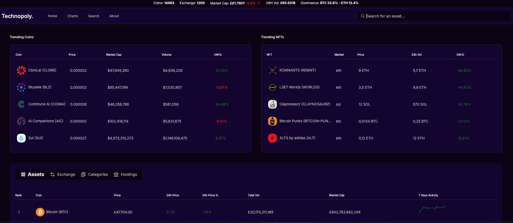 </img>
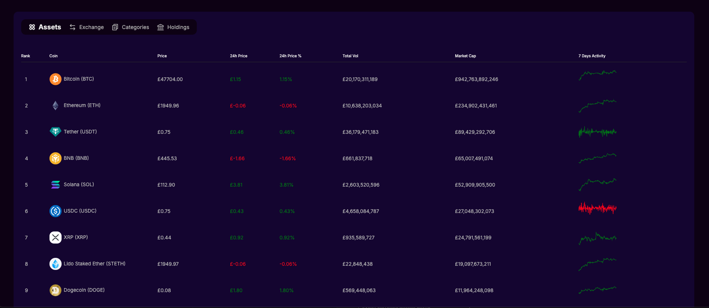 </img>

 The original version of Technoply compared to version 02 had a complete user interface overhaul. The original designs (the images you see above) were planned to look and feel like a desktop or tablet/mobile application. However, it didn't come across as a stand out front end developer project. I later decided to overhaul the front end UI with version 2.0 (website) for a more appealing UI that users feel more connected to.   

<h3> Technoply: Version 02 </h3>
<h4> Landing Page: Hero  </h4>
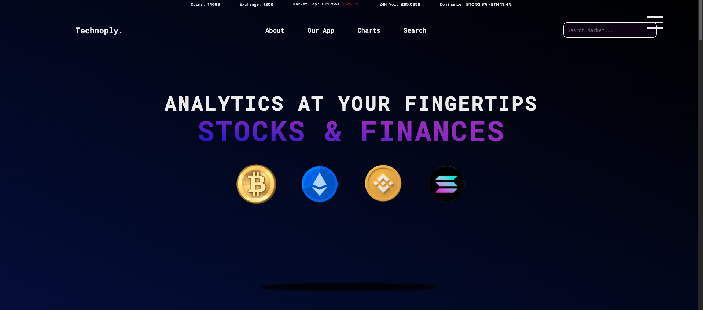 </img>

 All of Technoply's features can be accessed from the main page. The About and Our App nav links don't send the user to any external page and smooth scroll to the intended section the user is requesting. To access the main page from either the charts or search page, clicking the Technoply logo will send the user back to the main page.  

For a better user experience, the user doesn't have to click the search page to access the crypto search engine tool, but simply typing your request in the search box on any page will perform the request and direct the user to the search result.   

 </img>

 Illustrated above is the global section that fetch live data of important categories covering active coins and the exchanges that happened in the last 24 hours, the current market cap with interactive JavaScript that highlights red or green depending on the positive or negative direction, and the 24th vol with the dominance percentage of bitcoin and Ethereum in the market. The global section can be expanded upon hover for better visability.

<h4> Landing Page: About </h4>
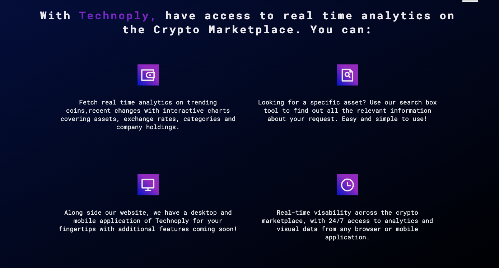 </img>

 About can easily be smooth scrolled to by clicking the connected navigation link. The original version of Technoply had the about section on an external page. For Version 02, I focused more on developing a more appealing front end UI and intergrated most of the website into a single page. The about section provides a simple breakdown of the four core feature of Technoply by accessing real time data, the search engine, the desktop application (which is version 01) and visual charts to represent data. 
  

<h4> Landing Page: Trending  </h4>
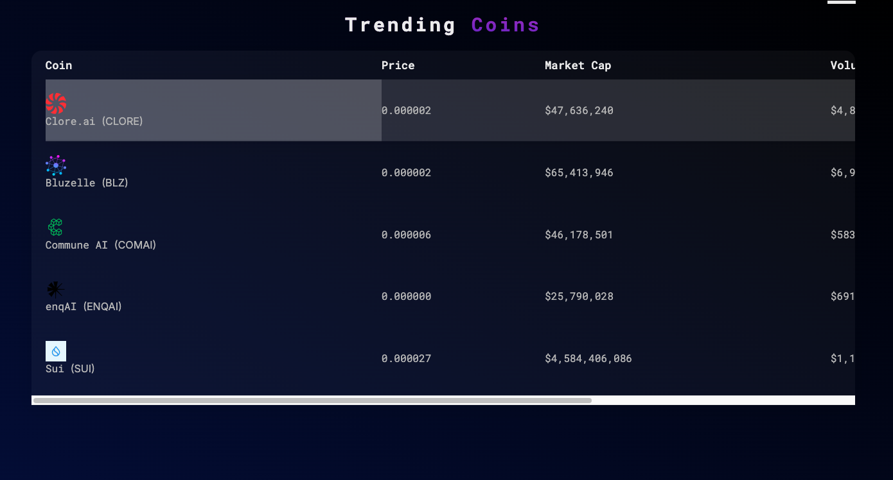 </img>

 Coin Gecko public API is the service used in the Technoply application, alongside TradingView to fetch live data on crypto currencies and NFT's. For the Trending section, I include the top 5 most popular trending currencies that detail the current price, market cap, and the volume number/percentage. To see more currencies besides the most recent trending, usig the search engine or scrolling down to the analytics section provides further detailed currency data.
  

<h4> Landing Page: Our Application </h4>
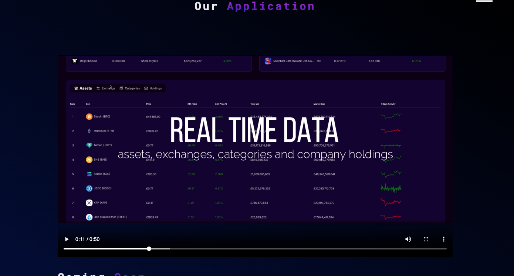 </img>

 For the original version of Technoply fitting a desktop application more than a website, I decided not to discard version 01 and used the idea Technoply also provides an app version of the service.  
  

<h4> Landing Page: Technoply Analytics </h4>
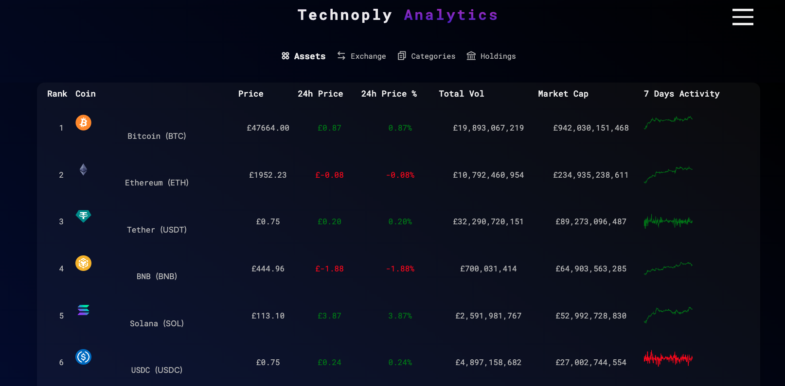 </img>
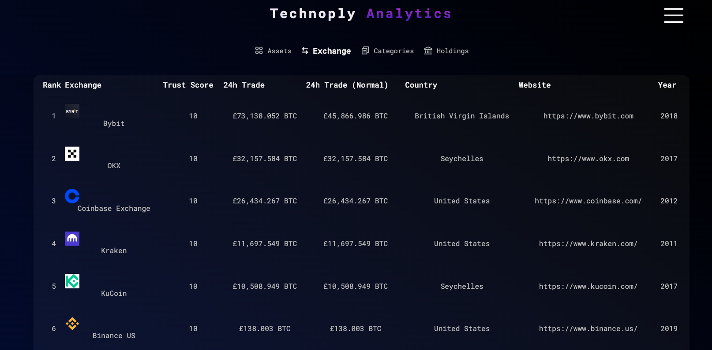 </img>
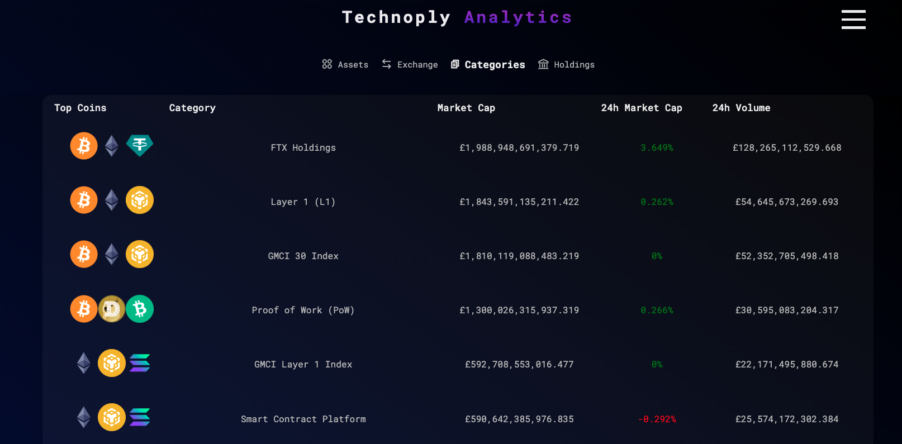 </img>
 </img>

 The main analytics section for the website that fetch live data from Coin Gecko API, with assests, exchanges, categories and company holdings. I incorporated TradingView into the project along with the data I used from CoinGeckoAPI to provide the 7-day activity of any assets display into the asset tab. If the API fails to complete a search, a red text error message will pop up for the user indicating the API is unavailable.  

Each of the assets, exchanges, categories and company holdings displayed on screen are ranked in order by the market cap (assets), 24 hour trade (exchange), and the total BTC company holdings (holdings). Each tab covers the top 20 ranking and the positive and negative percentages and market cap are displayed either green or red. 
  

<h4> Charts Page </h4>
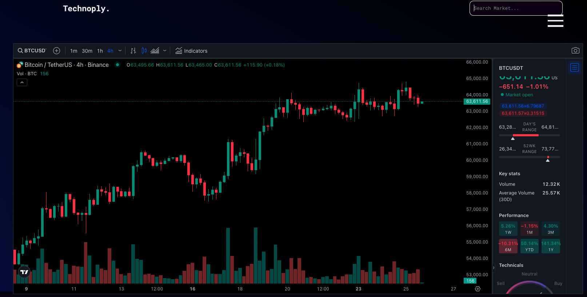 </img>

 Intergrating advanced Crypto BINANCE graph from TradingView and its features. The features I included from TradingView to use in Technoply was downloading images, using the indicators menu for indepth details, and a search tool to use on various cryto currencies. The charts page can be accessed from the main navigation, or from the hamburger menu. 
  

<h4> Search Page </h4>
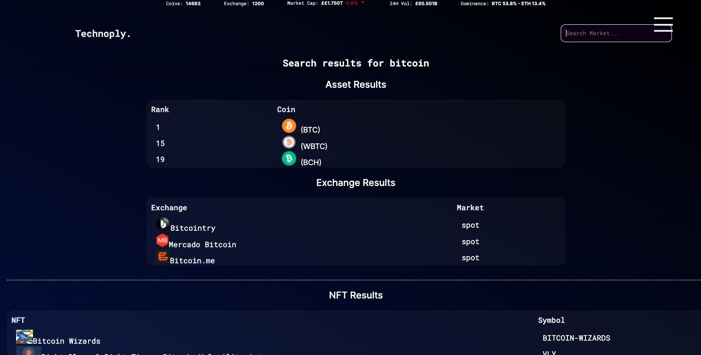 </img>

 The search engine can be easily accessed on any page. Either select it from the main navigation, the hamburger menu or use the textbox in the top right hand corner on any page to perform your search request. A search request will provide data of crypto currency rankings, the recent exchanges and NFTS. If the API fails to complete a search, a red text error message will pop up for the user indicating the API is unavailable.  

